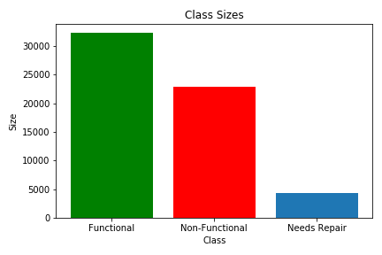
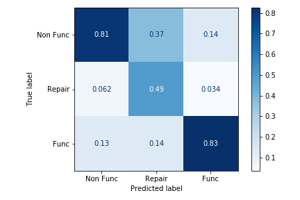
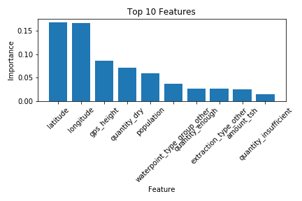
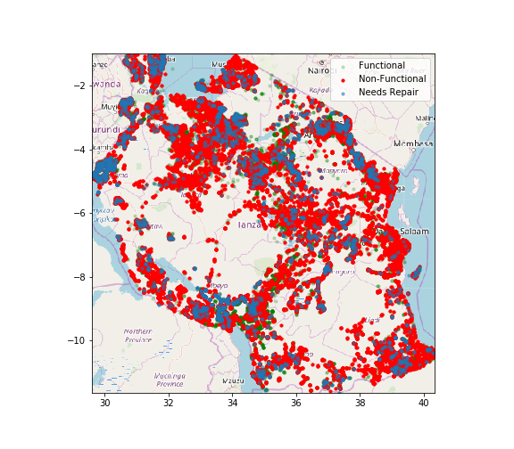
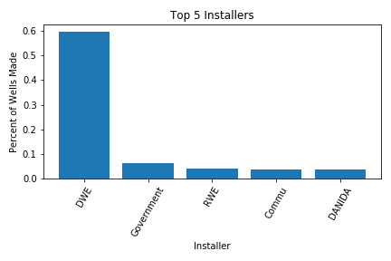

# Needs to be updated for updates processes and results
---
# Water Wells in Tanzania


## Problem Summary
Given a set of data, I need to predict the functionality of water pumps into three 
specific classifications:
1. Functional
2. Non-Functional
3. Functional, Needs Repair

You can read more about the 
<a href='https://www.drivendata.org/competitions/7/pump-it-up-data-mining-the-water-table/'>
challenge here.
</a>

---

# Data
The data provided is from Taarifa and the Tanzanian Ministry of Water. There are
a few things to note about the data.
* Training data includes 59,400 entries with 40 columns
* There are null values depending on the column we consider
* Column dtypes are not all well-optimized
* Some of the columns provide the same or very similar information
* Testing data includes 14,850 entires with 40 columns

There is a significant amount of cleaning to perform on my datasets. I will also
have to figure out which columns to keep depending on several factors, such as
correlation and importance.

---

# Approach
I will break down my approach into several key steps:
1) Import data and cast to appropriate dtypes
2) Handle null values and other general cleaning steps
3) Create a quick model to find feature importance
4) Decide columns to keep and finish cleaning processes
5) Build several models and choose the best performing model

There is a class imbalance in the dataset. It would be best practice to account
for the imbalance to try to improve the model.


---

# Walkthrough
* *config.ini* and *config_example.ini* <br><t>
I am getting into the habit of creating a configuration file, *config.ini*. 
This file allows me to edit my paths in once location. Now I'll save myself a
headache from updating paths in every single file. This configuration file can 
even be used for other purposes, such as saving usernames and passwords. I can 
even add it to the *.gitignore* to protect private information.
</t></br>

* */Notebooks/* <br><t>
There are several jupyter notebooks in this directory. These notebooks house the
code I used for all my processes, from data cleaning to model building. I will
include comments and any additional notes not mentioned in the *README.md*.
</t></br>

* */src/*<br><t>
There are several *.py* files in this directory. These *.py* files are essentially
the same as my notebooks. They are just truncated versions that only contain the
code necessary to perform all the cleaning and model building steps. This will be
created last. 
</t></br>

* *environment.yml* <br><t>
I am running Python 3.10.4 in a conda environment named "updated". 
This will let you view and/or recreate the environment I used on this project.
Run the following lines of code based on your needs:
```python
# To export the environment
conda activate updated
conda env export > environment.yml

# To recreate the environment using a .yml file
conda env create -f environment.yml
```
</t></br>

---

# Current Conclusion
Currently my best performing model in this competition is a Random Forest Classifier.

A quick breakdown on the metrics used:
* Precision: <br><t>
  Ratio of positive predictions to the total predictions for that category. This tells me how many total predictions were correct.
  </br></t>
* Recall: <br><t>
  Ratio of correct guesses to the total *actual* values for that category. This
  tells me if I am correctly predicting each category.
  </br></t>
* F1-Score: <br><t>
  A balance between precision and recall. This gives a better indication of
  general model performance. This tells me my model is making many correct predictions
  *and* correctly predicting classes.
  </br></t>
  
For a more in depth explanation of these metrics, go 
<a href='https://blog.exsilio.com/all/accuracy-precision-recall-f1-score-interpretation-of-performance-measures/'>
    here
</a>.


|                | precision | recall | f1-score |
|----------------|-----------|--------|----------|
| functional     | 0.81      | 0.87   | 0.84     |
| needs repair   | 0.49      | 0.32   | 0.39     |
| non functional | 0.83      | 0.78   | 0.80     |



The X-axis is what our model predicts, and the Y-axis is what the actual value
would be. The diagonal of this confusion matrix tells us the precision of our
classifications.

Here are the top 10 features my model is using to make classifications.



---

# Exploratory Data Analysis
Here I explore some of the features my model uses to predict our classifications.



This gives us a quick look of how each classification is spread in Tanzania.
A significant amount of wells that are non-functional are not only in highly
populated areas, but also in areas that are along the borders or in more remote
areas.


This gives the percentage of wells that are non-functional for each well type.


This gives the percentage of wells that are non-functional for each water qunatity
group.



This gives us the top 5 well installers in Tanzania and the percentege of wells
they made. The Department of Water Engineer(DWE) have made almost 60% of all the
wells in Tanzania.

---

# Results

## Update (7/25/22)
With my updated processes, I got a classification rate of .8015. This 
puts me at a rank of 3429 out of 13881. This is a drastic improvement from my
prior score of 0.4191. The changes I made came from work experience and additional
methodologies I found in search of improving my skills. I hope I can continue to
make improvements and get a better score.

## Old
I managed to get an f1-score of 0.4191. According to the scoreboard, this ranks 
me as 4965 out of 13541. While the initial score was good, this still shows that 
there is a lot of room for improvement.

---

# Next Steps
There are several items on my list for improving this project. The first is to 
split the original water_well_work.ipynb notebook into several notebooks and 
source files. This is to split the process into its various components and 
streamline the process into something that would most likely represent an
actual work setting. I will tackle this first to give the structure of this
project new life and to refamilarize myself with the work I had previously done.

After that, I will improve on my data cleaning process to have a more robust 
dataset that may also include newly engineered features. I will then test
different types of machine learning models, including those that I have
learned about since the last time I worked on this project. By the end of my
changes, this repo will look completely different.